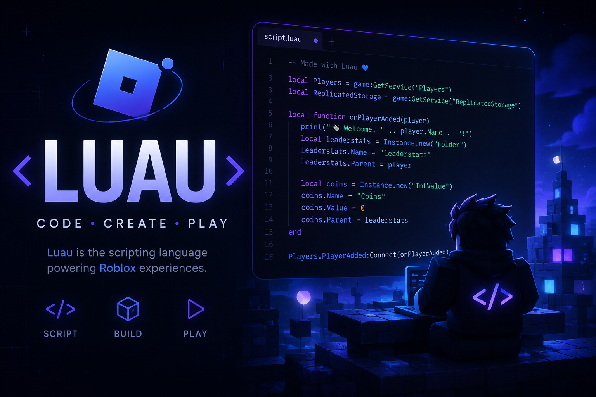

# helobro

A comprehensive collection of **Luau/Roblox scripts** featuring game-specific hubs, utilities, and enhancements for various Roblox games.

## 📚 Overview

This repository contains **100+ Luau scripts** designed for Roblox game modification and enhancement. The scripts range from simple utilities to complex game-specific hubs with multiple features.

## 🎮 Featured Games

Some of the major games covered include:

- **Da Hood** - DaHoodHub
- **Brookhaven** - BrookhavenHub
- **Piggy** - PiggyHubV4
- **Evade** - EvadeHub
- **Dandy's World** - DandysWorldHub
- **Pet Simulator 99** - PetSim99Hub
- **Forsaken** - ForsakenHub
- **Sell Lemons** - SellLemons
- And many more!

## 📁 Script Categories

### Game-Specific Hubs
- Complete feature sets for individual games
- Game-specific utilities and cheats

### Utility Scripts
- Teleportation tools
- ESP and visibility mods
- Physics modifications
- Server hopping utilities

## 🚀 Getting Started

### Requirements
- Roblox game client from rdd (https:/:
- Script executor that supports high quality scripts(Supported Executers: solara, bytebreaker, real, velocity, any paid executor, madium.)

## 📝 Script Structure

Most scripts follow this general pattern:

## ⚠️ Disclaimer

These scripts are provided for **educational purposes only**. Use at your own risk and be aware of roblox staff

## 🤝 Contributing

Contributions and improvements are welcome! Feel free to:

- Report bugs or issues
- Suggest new scripts
- Optimize existing code

## 📞 Support

For issues or questions about specific scripts:

1. Join the discord
2. Message me on discord

## 📊 Repository Stats

- **Language**: Luau
- **Scripts**: 100+
- **Last Updated**: June 2026
- **Stars**: 1

Subscribe!
https://youtube.com/@ActusisGames
